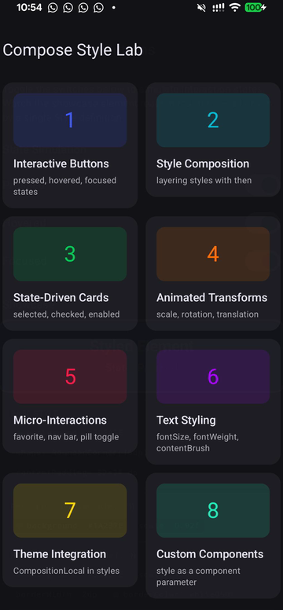
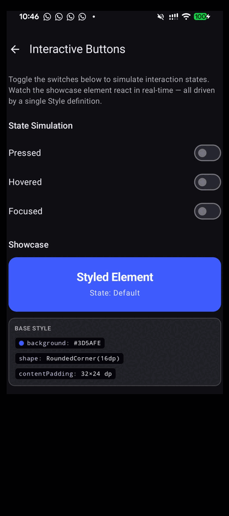
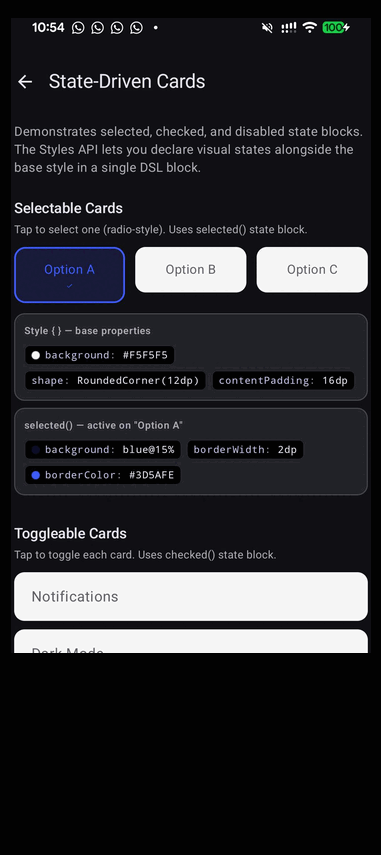
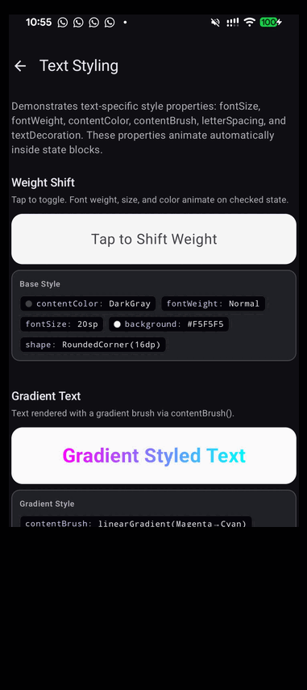
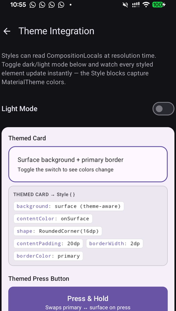

<p align="center">
  
</p>

<h1 align="center">Compose Style Lab</h1>

<p align="center">
  First-mover demo app for the <strong>Compose Styles API</strong> — the new experimental<br/>
  declarative styling system in Jetpack Compose.
</p>

<p align="center">
  <a href="https://aditlal.dev/compose-styles"></a>
  <a href="https://developer.android.com/jetpack/androidx/releases/compose-foundation"></a>
  <a href="LICENSE"></a>
</p>

---

## What is the Styles API?

The Styles API (`@ExperimentalFoundationStyleApi`) introduces a declarative way to define visual properties and interaction states for composables. Instead of managing `InteractionSource`, `animateColorAsState`, and multiple modifier chains, you define everything in a single `Style { }` block:

```kotlin
// Before: 15+ lines of imperative state management
val isPressed by interactionSource.collectIsPressedAsState()
val bgColor by animateColorAsState(if (isPressed) Color.DarkBlue else Color.Blue)
val scale by animateFloatAsState(if (isPressed) 0.95f else 1f)

// After: Declare what each state looks like. Done.
val style = Style {
    background(Color.Blue)
    shape(RoundedCornerShape(12.dp))
    contentPadding(16.dp)
    pressed(Style {
        animate(Style {
            background(Color.DarkBlue)
            scale(0.95f)
        })
    })
}

Box(Modifier.styleable(styleState = styleState, style = style))
```

Read the full deep-dive at **[aditlal.dev/compose-styles](https://aditlal.dev/compose-styles)**.

---

## Labs

### Lab 1 — Interactive Buttons

Toggle switches simulate `pressed`, `hovered`, and `focused` states. Watch the showcase element react in real-time — all driven by a single `Style` definition.



### Lab 3 — State-Driven Cards

`selected()`, `checked()`, and `disabled()` state blocks. Tap cards to see blue selection borders appear and green checked backgrounds animate in.



### Lab 6 — Text Styling

`fontSize()`, `fontWeight()`, `contentColor()`, `contentBrush()`, `letterSpacing()`, and `textDecoration()` — all inside `Style {}` blocks with automatic animation.



### Lab 7 — Theme Integration

Styles read `MaterialTheme` colors at resolution time. Toggle dark/light mode and watch every styled element update instantly.



### All 8 Labs

| # | Lab | Styles API Features |
|---|-----|-------------------|
| 1 | **Interactive Buttons** | `pressed`, `hovered`, `focused` + `animate` |
| 2 | **Style Composition** | `Style.then()`, `Style(s1, s2, s3)` factory |
| 3 | **State-Driven Cards** | `selected`, `checked`, `disabled` states |
| 4 | **Animated Transforms** | `scale()`, `rotationZ()`, `translationX/Y()` |
| 5 | **Micro-Interactions** | favorite, nav bar, pill toggle with `checked()` |
| 6 | **Text Styling** | `fontWeight()`, `contentColor()`, `contentBrush()` |
| 7 | **Theme Integration** | CompositionLocal access inside styles |
| 8 | **Custom Components** | `style: Style` as component parameter + defaults objects |

---

## Critical Alpha06 Gotcha

`styleable(style = myStyle)` without an explicit `styleState` does **NOT** detect interaction states from sibling modifiers. You must create and pass a `MutableStyleState`:

```kotlin
// Toggle states (checked, selected, enabled) — set explicitly:
val styleState = remember { MutableStyleState(MutableInteractionSource()) }
styleState.isChecked = isChecked

// Interaction states (pressed, hovered) — share the interactionSource:
val interactionSource = remember { MutableInteractionSource() }
val styleState = remember { MutableStyleState(interactionSource) }

Box(
    Modifier
        .styleable(styleState = styleState, style = myStyle)
        .clickable(interactionSource = interactionSource, indication = null) { }
)
```

See [`STYLES_API_GUIDE.md`](STYLES_API_GUIDE.md) for the full developer reference.

---

## Requirements

- Android Studio Ladybug or later
- Min SDK 24, Target SDK 35
- `androidx.compose.foundation:foundation:1.11.0-alpha06`

## Build

```bash
./gradlew assembleDebug
```

## Resources

- [Blog post: Deep-dive into the Compose Styles API](https://aditlal.dev/compose-styles)
- [`STYLES_API_GUIDE.md`](STYLES_API_GUIDE.md) — Complete developer reference
- [Compose Skill](https://github.com/aldefy/compose-skill) — AI agent skill for Jetpack Compose (includes Styles API reference)
- [AOSP Source](https://github.com/androidx/androidx/tree/androidx-main/compose/foundation/foundation/src/commonMain/kotlin/androidx/compose/foundation/style) — `androidx.compose.foundation.style`

## License

MIT
